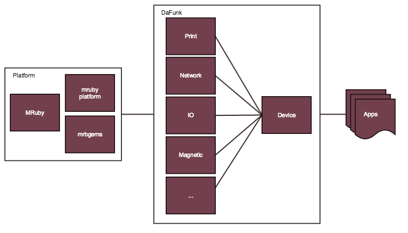

# mruby-da-funk

MRuby for non embedded platforms to be compliance with DaFunk API.

# Map

## Setup

1. Install Ruby and Bundler, check [here](https://rvm.io/rvm/install)
2. Install cloudwalk cli, check [here](http://cli.cloudwalk.io)
3. Setup submodules `rake setup`
4. Create build.rb, see [Docs](https://github.com/mruby/mruby/tree/1.1.0/doc), [Sample Cross Compilation](https://github.com/cloudwalkio/around_the_world/blob/master/build.rb) and [Sample MRuby](https://github.com/mruby/mruby/blob/1.3.0/build_config.rb)
5. Build `CONFIG=build.rb rake`

## Contributing

1. Fork it
2. Create your feature branch (`git checkout -b my-new-feature`)
3. Commit your changes (`git commit -am 'Added some feature'`)
4. Push to the branch (`git push origin my-new-feature`)
5. Create new Pull Request
